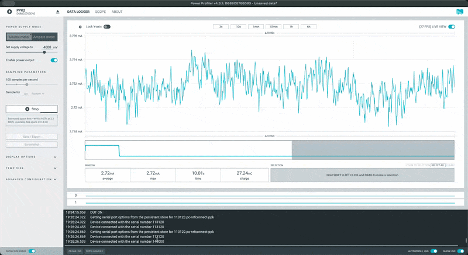
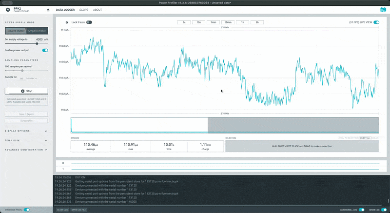

# Speaker Watchdog - ATtiny1607

## Overview

Monitors speaker power LED via LDR + comparator.
When LED goes OFF → wake from sleep → servo presses Fingerbot → wait for boot → sleep.

## Hardware

- PC2 (pin 19): Trigger input (comparator OUT + manual button, shared via R8 10K)
- PA5 (pin 6): Servo PWM (TCA0 WO5)
- PB2 (pin 14): TX (debug serial, TX-only)

### Our custom circuit

| LDR based comparator | Microcontroller | Board Top (Combined) | Board Bottom (Combined)| 3D Render of PCB |
| --- | --- | --- | --- | --- |
|  |  |  |  |  |

> [!Note]
[SCHEMATIC](HW/schematic.pdf) (V-1.0) 

> [!Tip]
> _Check below, towards the end, for a better version with more current saving (aka improved battery life)_

---

### Assembly (view)

<!--  -->

<p align="center">
  
</p>

| Board bottom view | Board top view | Side view | Angled view |
| --- | --- | --- | --- |
|  |  |  |  |

--- 

## Dependencies

- megaTinyCore: https://github.com/SpenceKonde/megaTinyCore
- Servo library: `#include <Servo_megaTinyCore.h>` (NOT `<Servo.h>`) Reason: [As Described here](https://github.com/SpenceKonde/megaTinyCore?tab=readme-ov-file#servo)

---

## Dev Setup

- IDE: Arduino IDE 2.3.8
- UPDI programmer: Could your [homebrewed one](https://github.com/SpenceKonde/AVR-Guidance/blob/master/UPDI/jtag2updi.md), but I used and followed instructions [from this one](https://learn.adafruit.com/adafruit-updi-friend?view=all)

### Compile and Upload settings:


---

## Flow

### SETUP (runs once at boot)
```
┌───────────────────────────────────────────────────────────────────┐
│  SETUP                                                            │
│  ─────                                                            │
│  1. disableSerialPins()            // TX/RX driven LOW            │
│  2. disableUnusedPins()            // unused pins → INPUT_PULLUP  │
│  3. ADC0.CTRLA &= ~ADC_ENABLE_bm   // disable ADC                 │
│  4. SPI0.CTRLA &= ~SPI_ENABLE_bm   // disable SPI                 │
│  5. setupTriggerPin()              // PC2 edge interrupt          │
│  6. servo.attach(PA5)                                             │
│  7. servo.write(SERVO_REST)                                       │
│  8. delay(500)                     // let servo settle            │
│  9. servo.detach()                 // stop PWM, save power        │
│ 10. sei()                          // enable global interrupts    │
│ 11. set_sleep_mode(SLEEP_MODE_PWR_DOWN)                           │
│ 12. sleep_enable()                                                │
└──────────────────────────────┬────────────────────────────────────┘
                               │
                               ▼
                          ENTER LOOP
```

### MAIN LOOP
```
┌─────────────────────────────────────────────────────────────────┐
│  LOOP START                                                     │
│  ──────────                                                     │
│  - Clear any pending interrupt flags                            │
│  - sleep_cpu()                                                  │
│  - ... MCU stops here, draws ~1-5µA ...                         │
└──────────────────────────────┬──────────────────────────────────┘
                               │
               Speaker turns OFF (LED OFF)
               OR manual button pressed
               → Edge on PC2 triggers ISR
                               │
                               ▼
┌─────────────────────────────────────────────────────────────────┐
│  ISR(PORTC_PORT_vect)                                           │
│  ────────────────────                                           │
│  - flags = VPORTC.INTFLAGS     // fast read                     │
│  - PORTC.INTFLAGS = flags      // clear flags                   │
│  - triggered = 1               // set flag for main loop        │
│  - (ISR exits, loop resumes after sleep_cpu)                    │
└──────────────────────────────┬──────────────────────────────────┘
                               │
                               ▼
┌─────────────────────────────────────────────────────────────────┐
│  1. WAKE CHECK                                                  │
│     - if (!triggered) → back to sleep (spurious wake)           │
│     - triggered = 0                                             │
│     - #ifdef DEBUG_ENABLED: Serial.begin(115200)                │
└──────────────────────────────┬──────────────────────────────────┘
                               │
                               ▼
┌─────────────────────────────────────────────────────────────────┐
│  2. DEBOUNCE                                                    │
│     - delay(50ms)                                               │
│     - Re-read PC2 actual state                                  │
│     - isValidTrigger():                                         │
│         Current module: valid if PC2 == HIGH (LED OFF)          │
│         Our PCB: valid if PC2 == LOW (LED OFF)                  │
│     - If NOT valid → false trigger → skip to step 6 (sleep)     │
└──────────────────────────────┬──────────────────────────────────┘
                               │
                               ▼
┌─────────────────────────────────────────────────────────────────┐
│  3. DISABLE INTERRUPT                                           │
│     - PORTC.PIN2CTRL &= ~PORT_ISC_gm                            │
│     - PC2 edges now ignored                                     │
│     - Prevents re-trigger during speaker boot LED dance         │
└──────────────────────────────┬──────────────────────────────────┘
                               │
                               ▼
┌─────────────────────────────────────────────────────────────────┐
│  4. SERVO PRESS                                                 │
│     - servo.attach(SERVO_PIN)                                   │
│     - servo.write(SERVO_PRESS)    // press position             │
│     - delay(200ms)                // hold press                 │
│     - servo.write(SERVO_REST)     // release                    │
│     - delay(200ms)                // settle                     │
│     - servo.detach()              // stop PWM, save power       │
└──────────────────────────────┬──────────────────────────────────┘
                               │
                               ▼
┌─────────────────────────────────────────────────────────────────┐
│  5. FIXED WAIT                                                  │
│     - delay(8000)                 // 8 seconds                  │
│     - Speaker boots, LED does dance, we ignore it all           │
│     - Interrupt is disabled so no re-triggers                   │
└──────────────────────────────┬──────────────────────────────────┘
                               │
                               ▼
┌─────────────────────────────────────────────────────────────────┐
│  6. RE-ENABLE + CLEANUP + SLEEP                                 │
│     - PORTC.PIN2CTRL = PORT_ISC_xxxx_gc   // re-enable edge     │
│     - PORTC.INTFLAGS = PIN2_bm            // clear pending      │
│     - #ifdef DEBUG_ENABLED:                                     │
│         Serial.flush()                                          │
│         Serial.end()                                            │
│         disableSerialPins()                                     │
│     - (loop restarts → sleep_cpu)                               │
└──────────────────────────────┬──────────────────────────────────┘
                               │
                               ▼
                      BACK TO LOOP START 
                            (sleep)
```

## Edge Cases

| Case | What Happens |
|------|--------------|
| Power-on with speaker already OFF | No edge = no ISR. User presses button to trigger manually. |
| False trigger (noise) | Wake → debounce → re-read shows LED ON → skip action → sleep |
| LED blinks during boot | Interrupt disabled during wait, no re-triggers |
| Button pressed during wait | Interrupt disabled, ignored |
| Speaker fails to turn on | We waited 8s anyway, go to sleep. Next OFF event retries. |

## Configuration

```cpp
// Debug output over serial (TX-only, 115200 baud)
// Comment out for production to save power
#define DEBUG_ENABLED

// Trigger polarity - depends on which LDR module you're using:
//   true  = off-shelf test module (PC2 HIGH when LED OFF)
//   false = our custom PCB (PC2 LOW when LED OFF)
#define INVERT_TRIGGER   true

// Servo positions in degrees - calibrate for your Fingerbot setup
#define SERVO_REST       90       // Resting position (not touching button)
#define SERVO_PRESS      45       // Press position (pushing Fingerbot button)

// Timing in milliseconds
#define DEBOUNCE_MS      50       // Wait after wake before validating trigger
#define PRESS_HOLD_MS    1000     // How long servo holds the press position
#define PRESS_SETTLE_MS  1000     // Wait for servo to return to rest before detach
#define SERVO_INIT_MS    1000     // Initial servo settle time at boot
#define BOOT_WAIT_MS     8000     // Wait for speaker boot (covers LED dance)
```

### Polarity of trigger (INTERRUPT) matters

| Module | LED ON | LED OFF | Trigger Edge |
|--------|--------|---------|--------------|
| [off-shelf](https://amzn.eu/d/02HeSikt) (Test Module) | PC2 LOW | PC2 HIGH | RISING |
| Our PCB | PC2 HIGH | PC2 LOW | FALLING |

> Use `#define INVERT_TRIGGER true` for Test module.

---

## Tests

Test sketches live in `tests/` folder. Use these before running the main firmware.

[`attiny1607_speaker_led_behaviour_test.ino`](tests/attiny1607_speaker_led_behaviour_test/attiny1607_speaker_led_behaviour_test.ino)

**Purpose:** Observe and analyze the speaker LED behavior (the "dance" pattern during boot).

**Use this to:**
- Verify your LDR/comparator circuit is detecting LED state changes
- Measure the speaker's startup LED timing
- Determine the correct `BOOT_WAIT_MS` value

**Hardware:**
- PC2 (pin 19) → Comparator OUT
- PB2 (pin 14) → TX to serial adapter RX

**Usage:**
1. Upload the sketch
2. Open serial monitor at 115200 baud
3. Turn speaker ON/OFF and observe output

**Example output:**
```
LED Analyzer started
Initial: ON
[1523] OFF (was ON 1523ms)
[1842] ON (was OFF 319ms)
[2105] OFF (was ON 263ms)
[2389] ON (was OFF 284ms)
[8245] OFF (was ON 5856ms)   ← longest ON = solid period
```

**Reading the output:**
- `[elapsed_ms]` = time since sketch started
- `ON` / `OFF` = current LED state (as seen by comparator)
- `(was STATE duration)` = previous state and how long it lasted

The longest `ON` duration before a final `OFF` tells you how long the LED stays solid after the boot dance. Set `BOOT_WAIT_MS` to be longer than this.

## OOps ma, HW could have been a bit better 😅

So. after assembly of the board adn uploading the program, found out that the idle current consumption of the system is around 2.5 mA and the peak, when the servo is active, is around 12 mA. So, even though we picked low current comparator, put our micro to deep sleep and all that, we will have an av. battery life of a month (if we are lucky) based on the following ...



| State | Current | Duration/day |
| --- | --- | ---| 
| Sleep (servo connected) | ~2.5 mA | ~23.9 hrs | 
| Wake + servo active | ~12 mA | ~0.1 hrs (5 triggers × ~1.2 min each) | 

### Daily consumption

```
(2.5 mA × 23.9 hr) + (12 mA × 0.1 hr) = 59.75 + 1.2 ≈ 61 mAh/day
```

#### Battery life for CR123A (1500 mAh):

```
1500 mAh / 61 mAh/day ≈ 24-25 days
```

But with the servo disconnected, we found out that the current consumption is very low, in deep-sleep. 
- **Deep Sleep state**: 0.1 mA (100µA) (_Of-course, there's room for improvement there too_)



### So the solution?

Add a low power MOSFET to control servo's power lines ...  

_WIP_

```
VCC (3V) ───┬─────────── Servo VCC (red)
            │
         [SOURCE]
            │
   MCU ──┬──[GATE]  SI2301 (P-FET)
   (PA6) │    │
         R1  [DRAIN]
        10k    │
         │    └─────────── Servo VCC
        GND

Servo GND ──────────────── GND
Servo SIG ──────────────── PA5 (existing)
```

_WIP_


## License

[MIT](LICENSE)
