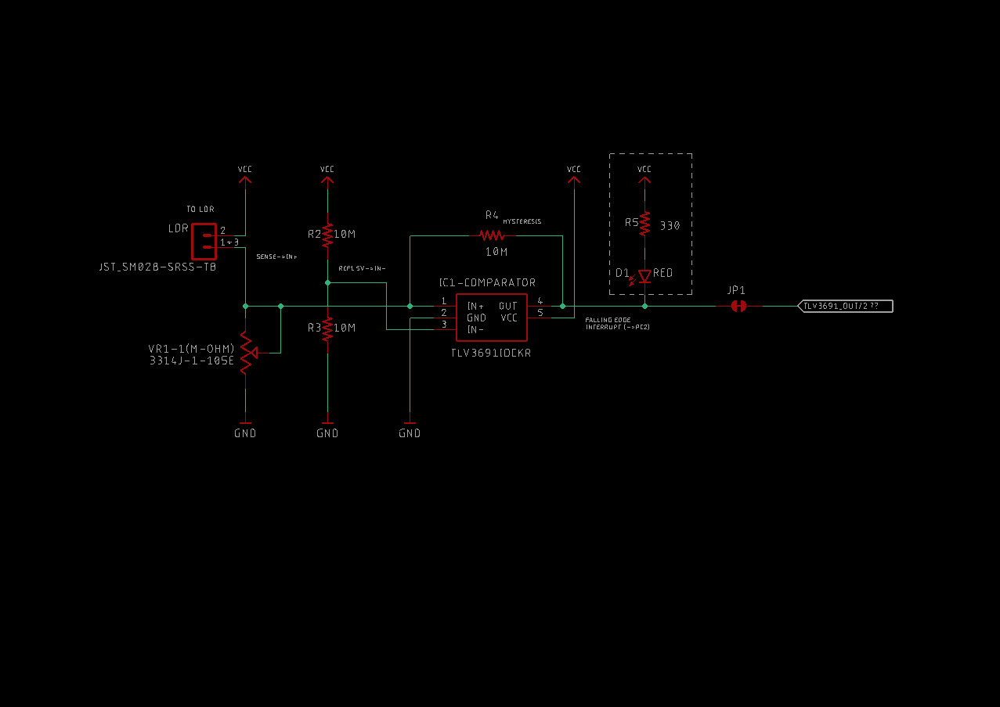
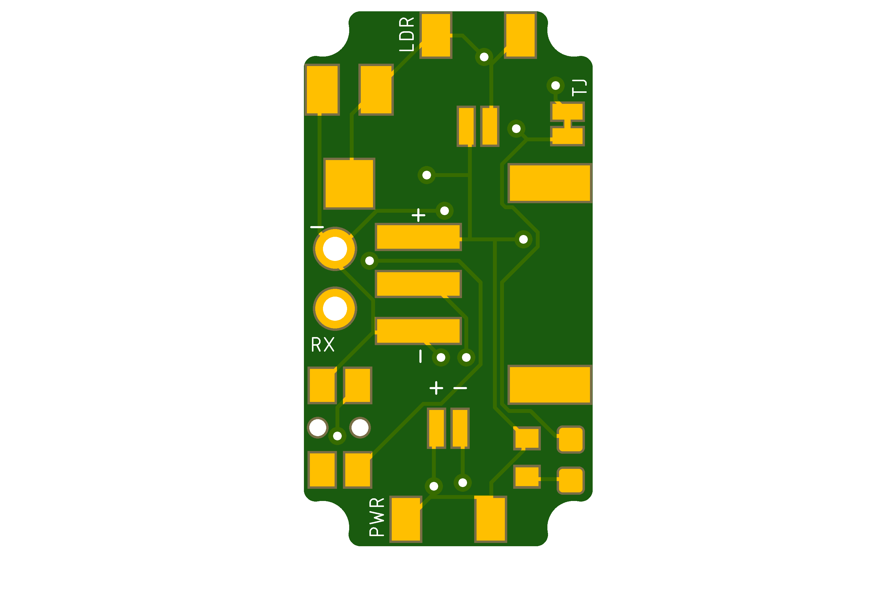
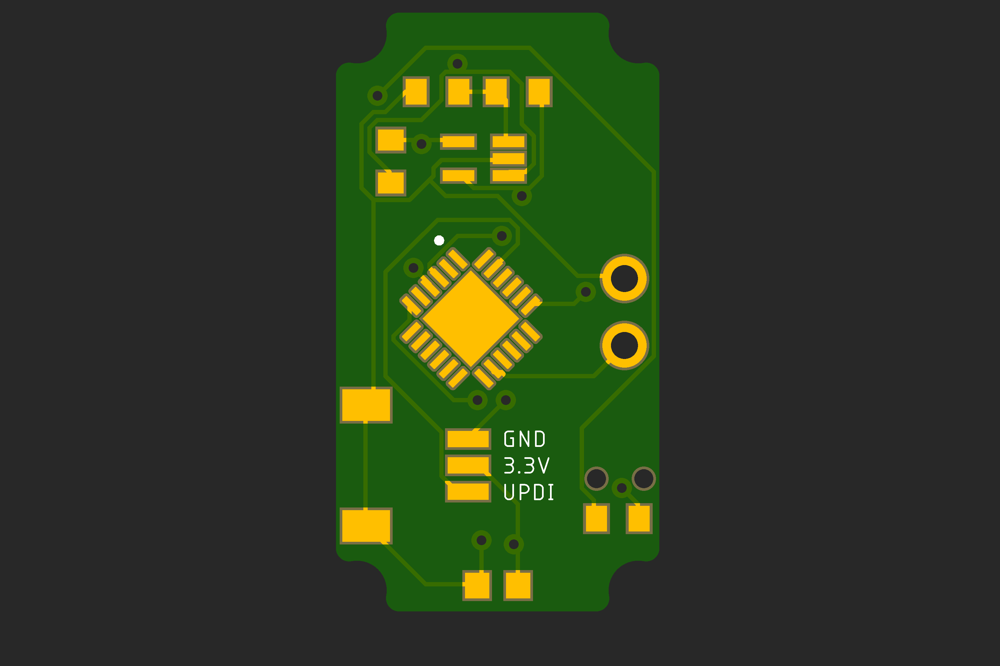
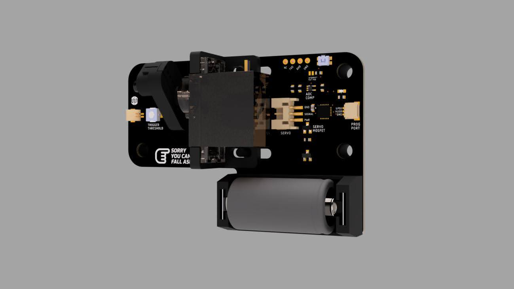
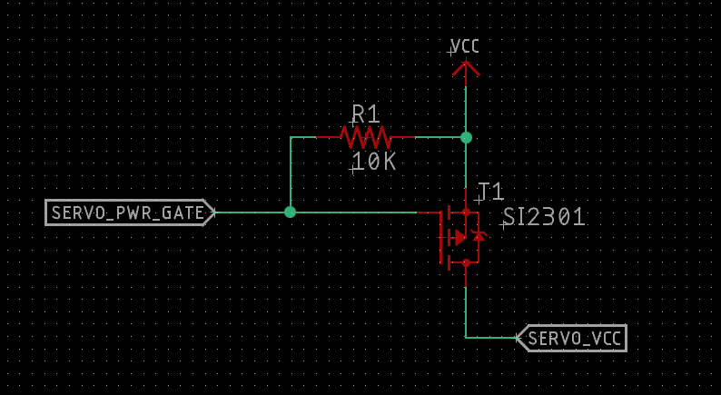
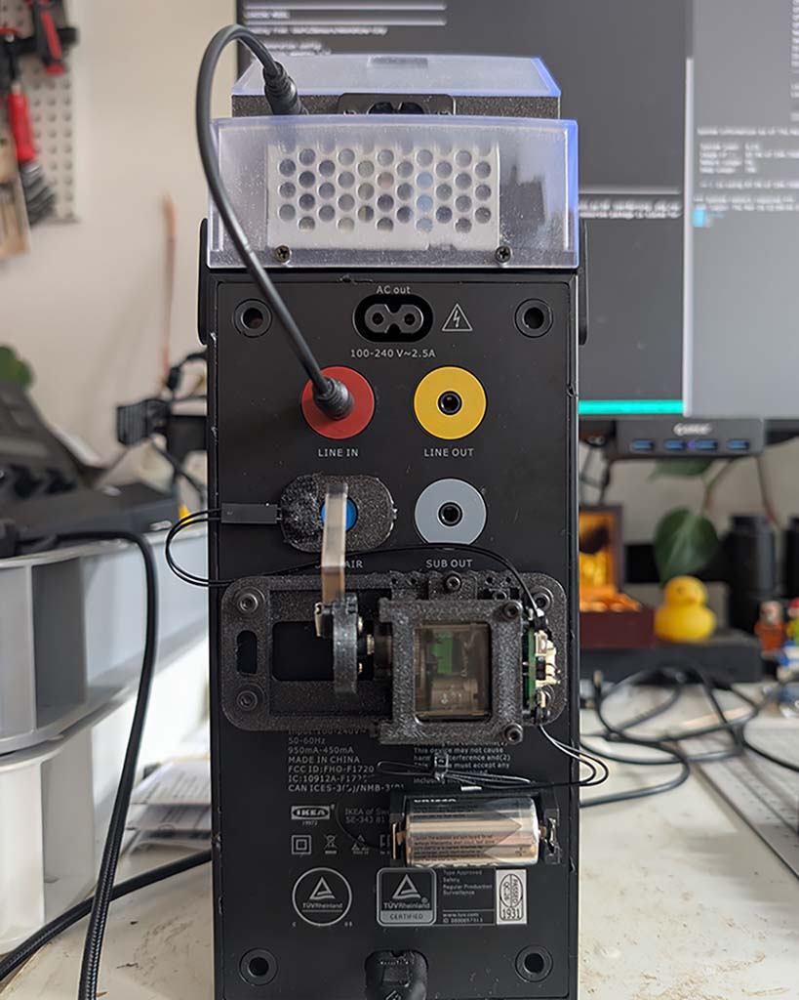
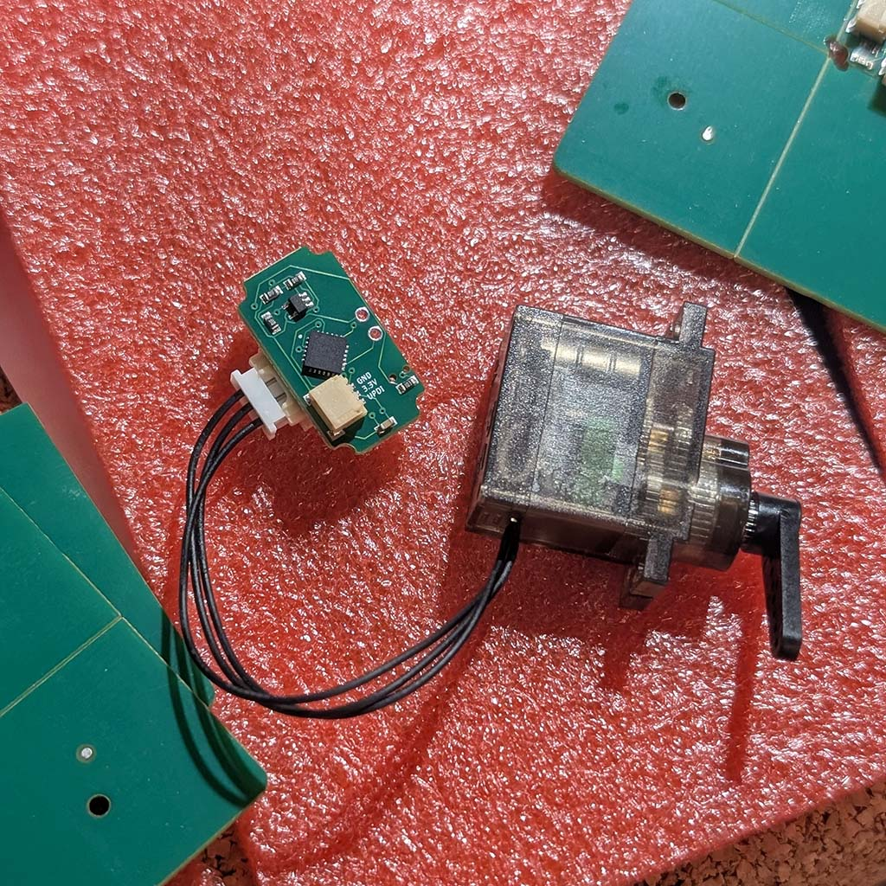
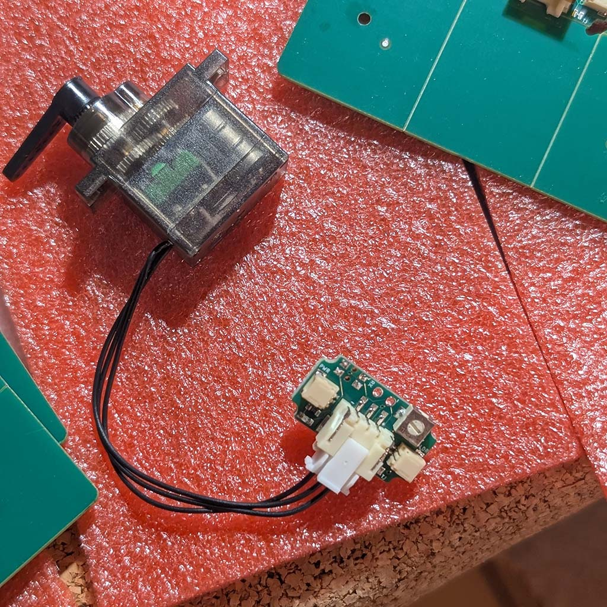
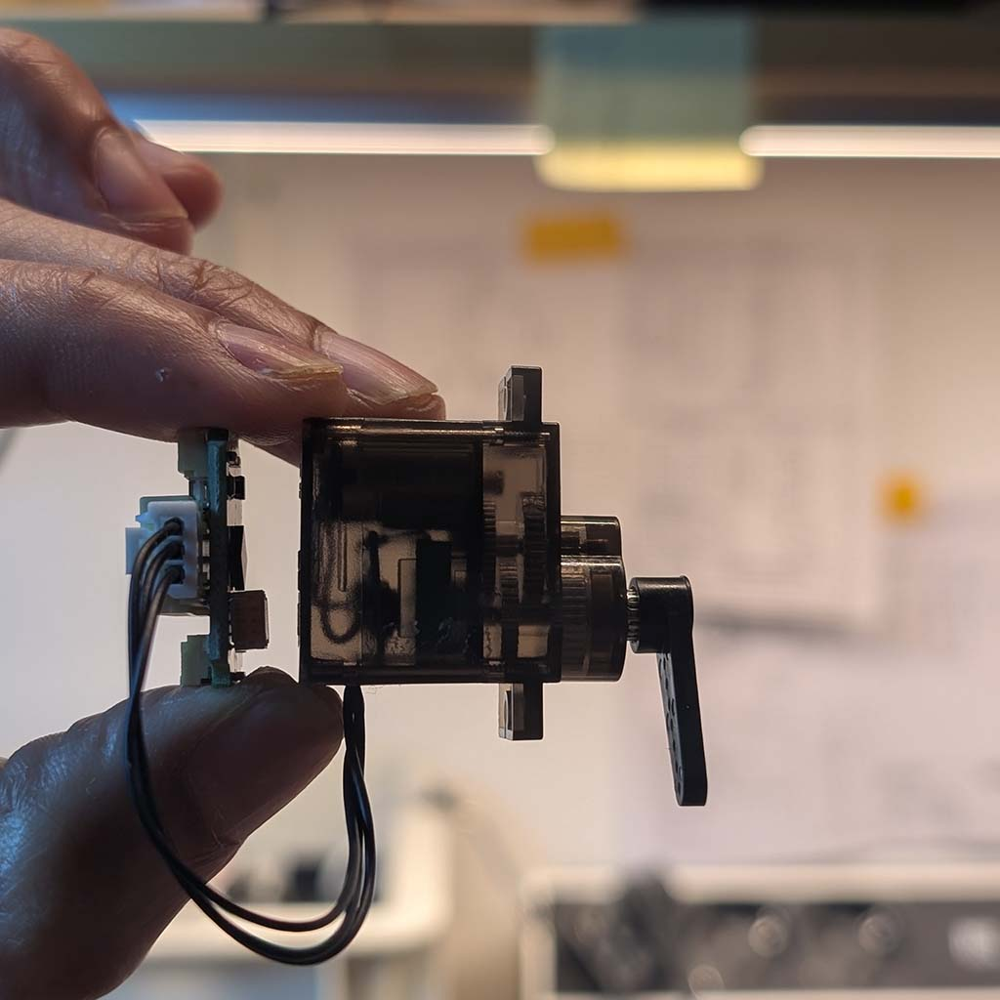
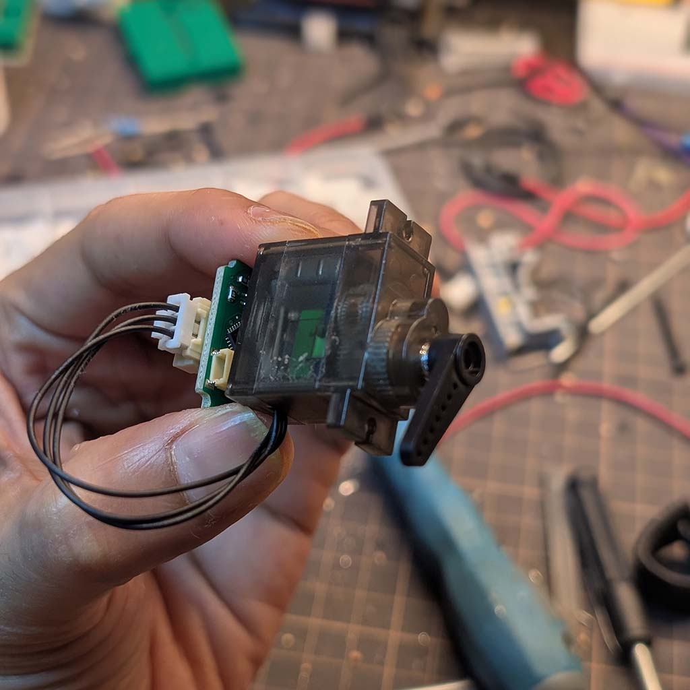

# Speaker Watchdog V2 - ATtiny1607

> [!Note]
> [attiny1607_speaker_fingerbot_v1](https://github.com/dattasaurabh82/attiny1607_speaker_fingerbot)

## Overview

Monitors speaker power LED via LDR + comparator.
When LED goes OFF → wake from sleep → servo presses Fingerbot → wait for boot → sleep.

## Hardware

- PC2 (pin 19): Trigger input (comparator OUT + manual button, shared via R8 10K)
- PA5 (pin 6): Servo PWM (TCA0 WO5)
- PA6 (pin 7): Servo power gate (SI2301 P-FET control) ← **V2**
- PB2 (pin 14): TX (debug serial)
- PB3 (pin 15): RX (via JP2 jumper) ← **V2**

### Circuit info

| LDR based comparator | Microcontroller | Board Top (Combined) | Board Bottom (Combined)| 3D Render of PCB |
| --- | --- | --- | --- | --- |
|  |  |  |  |  |

> [!Note]
[SCHEMATIC](HW/schematic.pdf) (V-2.0)   

### What changed from V1, in V2?
> Added SI2301 P-FET to control servo power, reducing sleep current from ~2.5mA to ~300µA. Battery life improved from ~25 days to **~6 months**!



| MCU PA6 | Gate | Vgs | FET State | Servo |
|---------|------|-----|-----------|-------|
| HIGH (or floating) | VCC | 0V | OFF | Unpowered |
| LOW | GND | -3V | ON | Powered |

---

### Assembly (view)

<!--  -->

<p align="center">
  
</p>

| Board bottom view | Board top view | Side view | Angled view |
| --- | --- | --- | --- |
|  |  |  |  |

--- 

## Dependencies

- megaTinyCore: https://github.com/SpenceKonde/megaTinyCore
- Servo library: `#include <Servo_megaTinyCore.h>` (NOT `<Servo.h>`) Reason: [As Described here](https://github.com/SpenceKonde/megaTinyCore?tab=readme-ov-file#servo)

---

## Dev Setup

- IDE: Arduino IDE 2.3.8
- UPDI programmer: Could your [homebrewed one](https://github.com/SpenceKonde/AVR-Guidance/blob/master/UPDI/jtag2updi.md), but I used and followed instructions [from this one](https://learn.adafruit.com/adafruit-updi-friend?view=all)

### Compile and Upload settings:


---

## Flow

### SETUP (runs once at boot)
```
┌───────────────────────────────────────────────────────────────────┐
│  SETUP (V2)                                                       │
│  ──────────                                                       │
│  1. disableSerialPins()            // TX/RX driven LOW            │
│  2. disableUnusedPins()            // PA6 NOT included (active)   │
│  2b. disableTWI()                  // PB0/PB1 OUTPUT LOW          │
│  3. disablePeripherals()           // ADC, SPI off                │
│  4. setupTriggerPin()              // PC2 edge interrupt          │
│                                                                   │
│  5. servoPowerOn()                 // PA6=LOW → FET ON            │
│  6. delay(SERVO_STABILIZE_MS)      // Let servo settle (20ms)     │
│  7. servo.attach(PA5)                                             │
│  8. servo.write(SERVO_REST)                                       │
│  9. delay(SERVO_INIT_MS)           // Servo settles               │
│ 10. servo.detach()                                                │
│ 11. pinMode(SERVO_PIN, INPUT_PULLUP)                              │
│ 12. servoPowerOff()                // PA6=HIGH → FET OFF          │
│                                                                   │
│ 13. sei()                          // Enable global interrupts    │
│ 14. set_sleep_mode(PWR_DOWN)                                      │
│ 15. sleep_enable()                                                │
└──────────────────────────────┬────────────────────────────────────┘
                               │
                               ▼
                          ENTER LOOP
                    (servo unpowered, ~300µA sleep)
```

### MAIN LOOP
```
┌─────────────────────────────────────────────────────────────────┐
│  LOOP START                                                     │
│  ──────────                                                     │
│  - Clear pending flags                                          │
│  - sleep_cpu()                                                  │
│  - ... MCU draws ~300µA (servo is OFF via FET) ...              │
└──────────────────────────────┬──────────────────────────────────┘
                               │
               Speaker turns OFF (LED OFF)
               OR manual button pressed
               → Edge on PC2 triggers ISR
                               │
                               ▼
┌─────────────────────────────────────────────────────────────────┐
│  ISR(PORTC_PORT_vect)                                           │
│  ────────────────────                                           │
│  - flags = VPORTC.INTFLAGS                                      │
│  - PORTC.INTFLAGS = flags                                       │
│  - triggered = 1                                                │
└──────────────────────────────┬──────────────────────────────────┘
                               │
                               ▼
┌─────────────────────────────────────────────────────────────────┐
│  1. WAKE + DEBOUNCE                                             │
│     - triggered = 0                                             │
│     - [DEBUG: Serial.begin()]                                   │
│     - delay(DEBOUNCE_MS)                                        │
│     - isValidTrigger() check                                    │
│     - If FALSE → return (skip to sleep)                         │
└──────────────────────────────┬──────────────────────────────────┘
                               │
                               ▼
┌─────────────────────────────────────────────────────────────────┐
│  2. DISABLE INTERRUPT                                           │
│     - disableTriggerInterrupt()                                 │
│     - PC2 edges now ignored (prevents LED dance re-trigger)     │
└──────────────────────────────┬──────────────────────────────────┘
                               │
                               ▼
┌─────────────────────────────────────────────────────────────────┐
│  3. AWAIT BEFORE PRESS                                          │
│     - delay(SERVO_PRESS_AWAIT)    // 2000ms                     │
│     - Speaker needs time after power-off before restart works   │
└──────────────────────────────┬──────────────────────────────────┘
                               │
                               ▼
┌─────────────────────────────────────────────────────────────────┐
│  4. SERVO PRESS (V2 - with power control)                       │
│     a. servoPowerOn()             // PA6=LOW → FET ON           │
│     b. delay(SERVO_STABILIZE_MS)  // Let servo power stabilize  │
│     c. servo.attach(SERVO_PIN)                                  │
│     d. servo.write(SERVO_PRESS)   // Press position (76°)       │
│     e. delay(PRESS_HOLD_MS)       // Hold 1600ms                │
│     f. servo.write(SERVO_REST)    // Release (30°)              │
│     g. delay(PRESS_SETTLE_MS)     // Settle 1000ms              │
│     h. servo.detach()                                           │
│     i. pinMode(SERVO_PIN, INPUT_PULLUP)                         │
│     j. servoPowerOff()            // PA6=HIGH → FET OFF         │
└──────────────────────────────┬──────────────────────────────────┘
                               │
                               ▼
┌─────────────────────────────────────────────────────────────────┐
│  5. BOOT WAIT                                                   │
│     - delay(BOOT_WAIT_MS)         // 8000ms                     │
│     - Speaker boots, LED dances, interrupt disabled             │
│     - Servo already OFF (power cut by FET)                      │
└──────────────────────────────┬──────────────────────────────────┘
                               │
                               ▼
┌─────────────────────────────────────────────────────────────────┐
│  6. RE-ENABLE + CLEANUP + SLEEP                                 │
│     - enableTriggerInterrupt()                                  │
│     - clearTriggerFlags()                                       │
│     - [DEBUG: Serial cleanup]                                   │
│     - sleep_cpu()                                               │
│     - ... Back to ~300µA sleep (servo unpowered) ...            │
└─────────────────────────────────────────────────────────────────┘
```

## Edge Cases

| Case | What Happens |
|------|--------------|
| Power-on with speaker already OFF | No edge = no ISR. User presses button to trigger manually. |
| False trigger (noise) | Wake → debounce → re-read shows LED ON → skip action → sleep |
| LED blinks during boot | Interrupt disabled during wait, no re-triggers |
| Button pressed during wait | Interrupt disabled, ignored |
| Speaker fails to turn on | We waited 8s anyway, go to sleep. Next OFF event retries. |
| Power-on reset (MCU) | PA6 floats briefly → R1 pullup keeps FET OFF → Servo safe |
| Brown-out | Same as power-on, R1 keeps servo unpowered |
| FET fails short | Servo always powered, falls back to V1 behavior (~25 days) |
| FET fails open | Servo never powered, no button press (fails safe) |

## Configuration

```cpp
// Debug output over serial (TX-only, 115200 baud)
// Comment out for production to save power
// #define DEBUG_ENABLED

// Trigger polarity - depends on which LDR module you're using:
//   true  = off-shelf test module (PC2 HIGH when LED OFF)
//   false = our custom PCB (PC2 LOW when LED OFF)
#define INVERT_TRIGGER   false

// Servo positions in degrees - calibrate for your Fingerbot setup
#define SERVO_REST       30       // Resting position (not touching button)
#define SERVO_PRESS      76       // Press position (pushing Fingerbot button)

// Timing in milliseconds
#define DEBOUNCE_MS         50    // Wait after wake before validating trigger
#define PRESS_HOLD_MS       1600  // How long servo holds the press position
#define PRESS_SETTLE_MS     1000  // Wait for servo to return to rest before detach
#define SERVO_INIT_MS       1000  // Initial servo settle time at boot
#define BOOT_WAIT_MS        8000  // Wait for speaker boot (covers LED dance)
#define SERVO_PRESS_AWAIT   2000  // Wait before pressing (speaker needs time)
#define SERVO_STABILIZE_MS  50    // V2: Let servo power stabilize after FET ON
```

### Polarity of trigger (INTERRUPT) matters

| Module | LED ON | LED OFF | Trigger Edge |
|--------|--------|---------|--------------|
| [off-shelf](https://amzn.eu/d/02HeSikt) (Test Module) | PC2 LOW | PC2 HIGH | RISING |
| Our PCB | PC2 HIGH | PC2 LOW | FALLING |

> Use `#define INVERT_TRIGGER true` for Test module.

---

## Tests

Test sketches live in `tests/` folder. Use these before running the main firmware.

[`attiny1607_speaker_led_behaviour_test.ino`](tests/attiny1607_speaker_led_behaviour_test/attiny1607_speaker_led_behaviour_test.ino)

**Purpose:** Observe and analyze the speaker LED behavior (the "dance" pattern during boot).

**Use this to:**
- Verify your LDR/comparator circuit is detecting LED state changes
- Measure the speaker's startup LED timing
- Determine the correct `BOOT_WAIT_MS` value

**Hardware:**
- PC2 (pin 19) → Comparator OUT
- PB2 (pin 14) → TX to serial adapter RX

**Usage:**
1. Upload the sketch
2. Open serial monitor at 115200 baud
3. Turn speaker ON/OFF and observe output

**Example output:**
```
LED Analyzer started
Initial: ON
[1523] OFF (was ON 1523ms)
[1842] ON (was OFF 319ms)
[2105] OFF (was ON 263ms)
[2389] ON (was OFF 284ms)
[8245] OFF (was ON 5856ms)   ← longest ON = solid period
```

**Reading the output:**
- `[elapsed_ms]` = time since sketch started
- `ON` / `OFF` = current LED state (as seen by comparator)
- `(was STATE duration)` = previous state and how long it lasted

The longest `ON` duration before a final `OFF` tells you how long the LED stays solid after the boot dance. Set `BOOT_WAIT_MS` to be longer than this.

---

## Power Consumption - V1 vs V2

### The V1 Problem

👉🏻 [Is described here](https://github.com/dattasaurabh82/attiny1607_speaker_fingerbot#oops-ma-hw-could-have-been-a-bit-better-)

### The V2 Solution

Added SI2301 P-FET to control servo power. Now the servo is completely unpowered during sleep!

| State | V1 Current | V2 Current |
| --- | --- | --- |
| Sleep | ~2.5 mA | **~300 µA** |
| Wake + servo | ~12 mA | ~12 mA |

**V2 Daily consumption:**
```
(0.3 mA × 23.9 hr) + (12 mA × 0.1 hr) = 7.17 + 1.2 ≈ 8.4 mAh/day
```

**V2 Battery life (CR123A 1500 mAh):** `1500 / 8.4 ≈ 179 days ≈ 6 months` 🎉


### V1 vs V2 Hardware Comparison

| Component | V1 | V2 |
|-----------|----|----|
| SI2301 P-FET (T1) | Not present | Added |
| R1 10K pullup | Not present | VCC → Gate |
| PA6 function | Unused | SERVO_PWR_GATE |
| JP2 (RX jumper) | Not present | Added |
| D1 (BAS70-05) | Present | **Must bypass for 3V operation** |
| Servo power | Always connected | Switched by FET |
| Sleep current | ~2.5 mA | **~300 µA** |
| Battery life | ~25 days | **~6 months** |

## License

[MIT](LICENSE)
